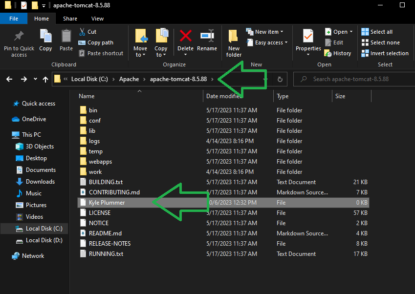

# Windows & Browser Basics
This exercise tests that you can:
 - Find an appropriate file on the internet, and download it
 - Find where the file downloaded
 - Create new directories
 - Navigate the Windows file structure
 - Cut/Copy/Paste files
 - Rename files
 - Take & save screenshots
 - Email attachments

## Exercise:
Complete this exercise with the following steps:

1. Find and download Apache Tomcat version 8.5. At the time of this writing you should find version 8.5.93, but any of the 8.5 subversions will suffice. We won't be using this software. You will need to search up the site, find the proper file, and download it. The one you want is:
`A Zip archive containing the binary distribution of the core Tomcat software, built for 64-bit windows.`

2. Find where this file downloaded to, and move it to a permanent location. You may need to create new directories if they don;t yet exist. Place the .zip file in the following location on your drive:
`C:\Apache\Tomcat\`

3. A Zip file is a compressed archive which contains one or more files, sometimes organized in folders. Extract the zip file from step 2 right into its current location. When finished you should find a file called "LICENSE" located:
`C:\Apache\Tomcat\apache-tomcat-8.5.93\LICENSE`
This assumes the version was 8.5.93. Any other 8.5 subversion is fine and the file path should reflect the version you downloaded. 

4. Create a new file here, and name it after yourself. Take a screenshot in which the file and the path to the file is clearly visible. For example:

Note: Your instance of Windows may be a different version, have a different theme, and may be showing this directory in a different view. The important elements are the full file path, and the file itself clearly visible. The green arrows in this example are just to point out those two important elements. 

5. Save the screenshot you made, and attach it to an email. Do not paste the image directly into the body of the email, it should be included as an attachment. Send this email to your trainer to complete this activity!